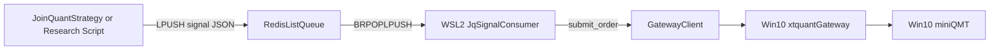

# JoinQuant Redis Bridge

## Purpose

This bridge lets a JoinQuant strategy publish low-frequency order intents into a Redis queue, and lets the local `quant` stack consume those intents and route them to `xtquant_gateway` / miniQMT.

Recommended use case:

- daily or quasi-daily rebalancing
- low-frequency minute decisions with tolerance for delayed simulated data

This is not designed for high-frequency execution.

## Implemented files

- JoinQuant strategy signal mode:
  - `test/jq_c1_smallcap_etf_combo.py`
- Signal schema:
  - `quant/bridge/jq_signal.py`
- Local consumer:
  - `scripts/jq_signal_consumer.py`
- Existing execution gateway:
  - `quant/gateway/client.py`
  - `scripts/run_xtquant_gateway.py`

## Architecture



## JoinQuant side

### 1. Switch script to signal mode

In `test/jq_c1_smallcap_etf_combo.py`:

```python
EXEC_MODE = "redis_signal"
```

### 2. Configure Redis queue target

Edit:

```python
SIGNAL_QUEUE_CONFIG = {
    "host": "your-redis-host",
    "port": 6379,
    "password": "your-password",
    "db": 0,
    "queue_key": "jq:signals",
    "use_tls": True,
    "timeout_sec": 5,
    "stale_after_sec": 900,
    "price_mode": "latest",
    "hmac_secret": "",
    "strategy_name": "c1_smallcap_etf_combo",
}
```

Notes:

- The strategy now imports `jq_research_redis_common.py` from JoinQuant research environment.
- `jq_research_redis_common.py` uses `redis-py`; install/add it in research environment before running in `redis_signal` mode.
- `price_mode`:
  - `latest`: local consumer sends `price_type=latest`
  - `limit_last`: local consumer sends `price_type=limit` with latest quote as the limit price
- `hmac_secret`:
  - optional but strongly recommended
  - must match consumer side `--hmac-secret` (or `JQ_SIGNAL_HMAC_SECRET`)

## Signal message schema

The queue payload is JSON with the following fields:

```json
{
  "schema_version": "v1",
  "source": "joinquant",
  "strategy_name": "c1_smallcap_etf_combo",
  "leg_name": "c1",
  "action": "target_value",
  "code": "000001.XSHE",
  "target_value": 25000.0,
  "generated_at": "2026-04-12T08:00:00+00:00",
  "bar_time": "2026-04-12T10:35:00",
  "client_order_id": "jq-c1-xxxxxxxxxxxxxxxx",
  "price_mode": "latest",
  "note": "rebalance target value",
  "signature": "hmac_sha256_hex"
}
```

### Semantics

- `action`: currently only `target_value`
- `target_value`: desired notional exposure for that symbol on that leg
- `client_order_id`: idempotency key
- `generated_at`: used for stale-signal rejection
- `signature`: optional HMAC-SHA256 signature for payload integrity/authentication

## Local consumer

### Start the gateway first

Example:

```bash
uv run python scripts/run_xtquant_gateway.py
```

Or on the Windows side, use your existing startup path with miniQMT.

### Start the consumer

Example:

```bash
uv run python scripts/jq_signal_consumer.py \
  --config config/live_qmt_http.toml \
  --redis-url "redis://:password@host:6379/0" \
  --queue-key "jq:signals" \
  --hmac-secret "$JQ_SIGNAL_HMAC_SECRET"
```

Optional dry run:

```bash
uv run python scripts/jq_signal_consumer.py \
  --config config/live_qmt_http.toml \
  --redis-url "redis://:password@host:6379/0" \
  --queue-key "jq:signals" \
  --dry-run
```

## Consumer behavior

- Reads from Redis list using `BRPOPLPUSH`
- Uses a processing list for basic ack-like safety
- Rejects stale messages (`--stale-after-sec`)
- Verifies HMAC signature when `--hmac-secret` is provided
- Uses two-level dedupe:
  - `processed:{client_order_id}` for final idempotency
  - `inflight:{client_order_id}` for concurrent in-flight lock
- Writes `processed` only after successful handling (or no-op), not before submit
- Retries failed messages up to `--max-retries`, then dead-letters
- Converts `target_value` into target quantity using:
  - gateway quote
  - current positions
  - lot-size rounding
- Submits the resulting delta order through `GatewayClient.submit_order()`
- Moves failed messages into:
  - `jq:signals:dead`

## Order conversion logic

For each signal:

1. fetch account / positions / quote from gateway
2. compute target quantity from `target_value`
3. compare with current quantity
4. derive delta quantity
5. submit:
   - `buy` if delta > 0
   - `sell` if delta < 0

No order is sent if:

- the signal is stale
- the signal is duplicate
- the computed quantity delta is zero

## Limitations

- JoinQuant simulated trading can lag. Community practice often suggests leaving about 2 minutes of buffer for minute-level simulated data; this bridge is therefore best suited for low-frequency usage.
- Queue messages express desired target value, not guaranteed fills.
- JoinQuant target holdings can drift from local actual holdings if local orders reject or only partially fill.
- This first version does not sync execution results back into JoinQuant.
- This first version does not do TWAP/VWAP slicing on the queue consumer side.

## Deployment topology (current)

Recommended and currently used layout:

- `Win10`: runs miniQMT + xtquant + `xtquant_gateway`
- `WSL2`: runs this repo (`scripts/jq_signal_consumer.py`, live daemon, research helpers)
- JoinQuant: publishes signals to Redis (direct strategy mode or research-environment helper)

References:

- [JoinQuant API 文档](https://www.joinquant.com/help/api/help#name:api)
- [请问带V的各位，聚宽会员的实时模拟会有延迟吗](https://www.joinquant.com/community/post/detailMobile?postId=62716)
- [实盘跟模拟回测收益差多少？](https://www.joinquant.com/community/post/detailMobile?page=3&postId=56740)

## Recommended first rollout

1. keep `EXEC_MODE = "direct_jq_order"` for baseline checks
2. switch to `redis_signal`
3. run consumer in `--dry-run`
4. verify quote, quantity, and side conversion
5. switch to live order submission

## Next improvements

- add a callback sink to write fills/order states back to Redis
- support `target_pct` messages
- support separate queue keys by strategy/account
- optionally add a small HTTP ingress service if direct Redis exposure is not desirable
